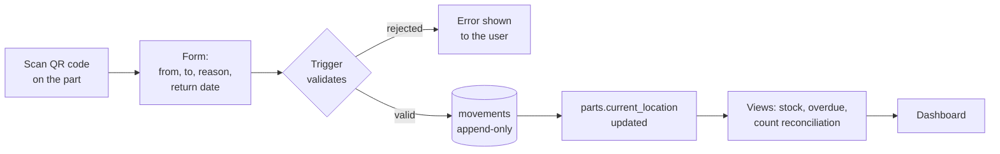
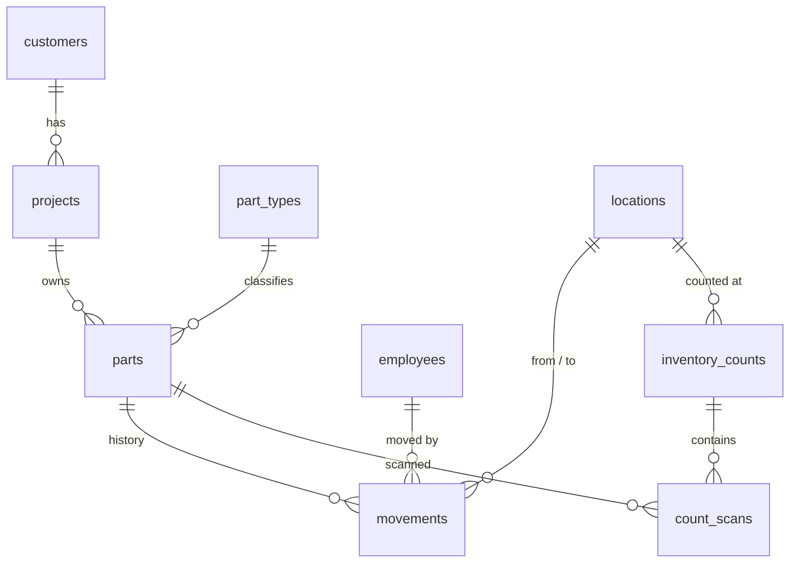

# Prototype Parts Inventory · PostgreSQL

[](https://github.com/lucasnunesf/prototype-inventory-sql/actions/workflows/database-checks.yml)

A relational model for tracking individual prototype parts: where each one is, where it has been, and who moved it. Business rules live inside the database, so a wrong record is rejected instead of silently becoming an inventory divergence.

> **Case study:** this repository rebuilds, in SQL, a process improvement I took part in during an internship at an automotive supplier, which cut inventory losses and movement rework by about 60%. The context, the team's solution and the results are in the [Notion case study](https://lucasnunesf.notion.site/Tracking-prototype-parts-with-QR-codes-81a917c89c17830b82b38101d66af8e3). All data here is synthetic.

---

## The problem

A prototype parts area handled **100+ part types for 10+ customers**. Parts constantly left the shelves: to the workshop, to tests, to other plants and to suppliers. Some came back, some did not.

There was no single record. Each person kept track of their own parts, so:

- the records did not match what was physically on the shelves (**divergence**), and
- even when a part existed, nobody knew for sure **where** it was.

## The real solution, and what this repo adds

The team gave **every physical part its own QR code**. Scanning it opened a form where people recorded what was taken, from where and to where, and a central spreadsheet became the control.

This repository models that same process as a PostgreSQL database. The form stays the same, but each submission becomes a row in a `movements` table, and the database itself enforces the rules the spreadsheet depended on people to follow.



## Business rules enforced by the database

| # | Rule | How |
|---|---|---|
| 1 | A part can only leave from where the system says it is | Trigger `fn_process_movement` |
| 2 | Movement type must match the route (e.g. a `TRANSFER` cannot go to a supplier) | Trigger |
| 3 | Parts sent outside the site need an expected return date | Trigger + `CHECK` |
| 4 | Scrapped parts cannot move again | Trigger |
| 5 | No back-dating before the part's last movement | Trigger |
| 6 | The history is append-only: no `UPDATE` or `DELETE`, corrections are `ADJUSTMENT`s | Trigger `fn_block_history_changes` |
| 7 | A part's current location is always derived from its movements | Trigger updates `parts` |

Rule 1 is the core of the project. In the spreadsheet, an unrecorded movement went unnoticed. Here, the next form for that part is rejected because the part is not where the record says, which forces the record to be corrected on the spot.

`sql/06_rule_checks.sql` tries to break each rule and confirms the database refuses. The checks run automatically on every push through GitHub Actions (badge above).

## Data model



Full diagram, table descriptions and design decisions: [docs/data-model.md](docs/data-model.md).

## Sample data

`scripts/generate_sample_data.py` simulates six months (April to September 2026) of the prototype area:

- **320 parts**, 108 part types, 11 customers, 17 vehicle programs
- **1,980 movements**: registrations, transfers, shipments, returns, scrap and adjustments
- **6 monthly counts** of all 24 shelf positions

The simulation tracks two locations for each part: where it **really** is and where the **system** thinks it is. About 7% of internal movements are never recorded, a few parts sent outside never return, and some parts are scrapped without a form. That is what creates the divergence that the counts and the rules then expose.

The generator uses a fixed random seed and only the Python standard library, so the output is always the same.

## Questions answered

All in [`sql/05_analysis_queries.sql`](sql/05_analysis_queries.sql):

| # | Question | SQL techniques |
|---|---|---|
| Q1 | How many parts does each customer have, and where? | `FILTER`, conditional aggregation |
| Q2 | Which parts are outside the site and late? Who sent them? | Set-returning function, `LATERAL` |
| Q3 | Complete history of one part | View over the audit trail |
| Q4 | Inventory accuracy per monthly count | `FULL JOIN` reconciliation |
| Q5 | Divergences in the last count, and where the system had the part | Point-in-time lookup |
| Q6 | How long do parts stay outside, and how many come back on time? | `LEAD()` window function |
| Q7 | How often were records corrected, and why? | `date_trunc`, grouping |
| Q8 | Parts untouched on a shelf for 60+ days | Date arithmetic |
| Q9 | Busiest shelf positions | `RANK()`, `SUM() OVER ()` |

Example, Q4 (inventory accuracy per count):

| count_date | matched | missing | unrecorded | accuracy_pct |
|---|---|---|---|---|
| 2026-04-30 | 156 | 0 | 1 | 99.4 |
| 2026-05-29 | 148 | 1 | 5 | 96.1 |
| 2026-06-30 | 170 | 1 | 9 | 94.4 |
| 2026-07-31 | 164 | 3 | 7 | 94.3 |
| 2026-08-31 | 165 | 4 | 9 | 92.7 |
| 2026-09-30 | 158 | 4 | 10 | 91.9 |

- **MISSING**: the system said the part was on that shelf, but it was not found.
- **UNRECORDED**: the part was found on that shelf, but the system had it somewhere else.

Accuracy drops as more parts circulate, because unrecorded movements pile up between counts. Each count resets the record for what it finds, and over the period 50 forms were rejected by rule 1 and corrected on the spot, instead of the error staying hidden until the next count.

## How to run it

**In the browser (no installation)**

1. Create a free PostgreSQL database on [Neon](https://neon.tech) and open its SQL Editor.
2. Run the files in `sql/` in order, pasting each one into the editor: `01` → `02` → `03` → `04` → `05` → `06`.
3. For your own queries, start with `SET search_path TO inventory;`.

**With PostgreSQL installed locally**

```bash
createdb inventory
for f in sql/0*.sql; do psql -d inventory -v ON_ERROR_STOP=1 -f "$f"; done
```

**To regenerate the sample data**

```bash
python scripts/generate_sample_data.py
```

## Repository structure

```
prototype-inventory-sql/
├── sql/
│   ├── 01_schema.sql            tables, keys and constraints
│   ├── 02_business_rules.sql    triggers and helper function
│   ├── 03_views.sql             stock, history, overdue parts, count reconciliation
│   ├── 04_sample_data.sql       generated synthetic data
│   ├── 05_analysis_queries.sql  nine business questions
│   └── 06_rule_checks.sql       automated checks of every rule
├── scripts/
│   └── generate_sample_data.py  six-month simulation
├── docs/
│   └── data-model.md            ER diagram and design decisions
└── .github/workflows/
    └── database-checks.yml      builds the database and runs the checks on every push
```

## Next steps

- Power BI dashboard connected to the database (current stock, overdue parts, count accuracy).
- A simple web form writing directly to `movements`, replacing the spreadsheet step.

---

**Stack:** PostgreSQL 16 · PL/pgSQL · Python · GitHub Actions

*All customers, projects, part types, locations and employees are fictional. No company data is used in this repository.*
