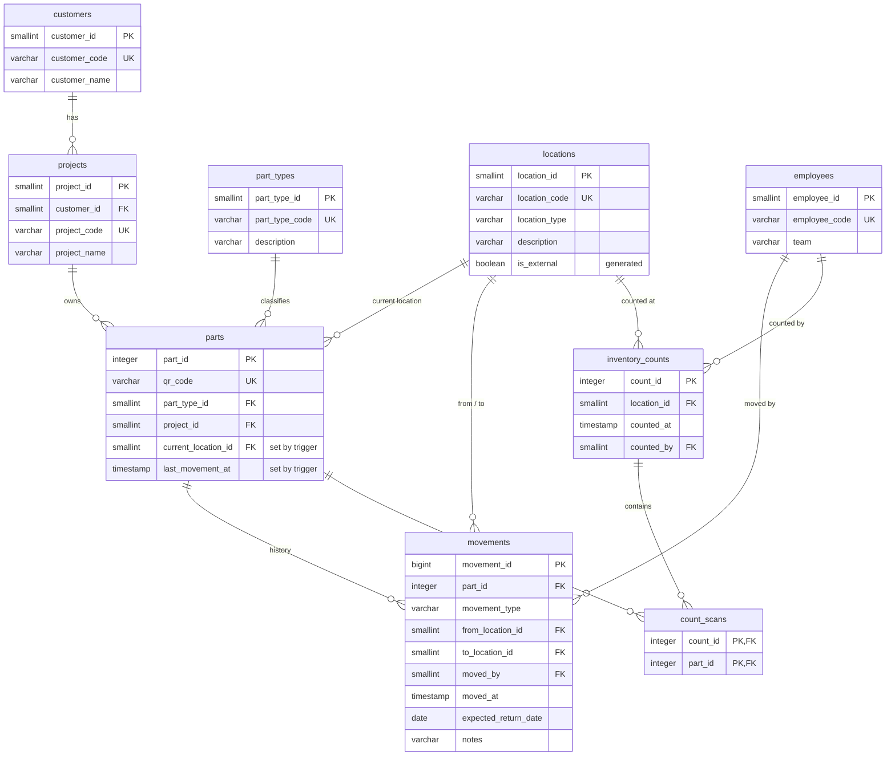

# Data model

All tables live in the `inventory` schema.

## Tables

| Table | One row per | Notes |
|---|---|---|
| `customers` | Vehicle manufacturer the prototypes belong to | |
| `projects` | Vehicle program of a customer | A customer can have several programs |
| `part_types` | Kind of component (e.g. steering gear, variant 3) | 108 types in the sample data |
| `locations` | Place a part can be | Shelf positions, workshops, test lab, external plants, suppliers, scrap area |
| `employees` | Person who moves or counts parts | Codes only, no personal data |
| `parts` | Physical prototype part | Each part has its own QR code. `current_location_id` is never written directly |
| `movements` | Form submission | Append-only. The part's location is derived from this history |
| `inventory_counts` | One location checked at one moment | Monthly counts of every shelf |
| `count_scans` | QR code scanned during a count | What was physically found |

## Movement types

| Type | Route | Extra requirement |
|---|---|---|
| `REGISTRATION` | (nothing) → warehouse | First record of a part |
| `TRANSFER` | Internal → internal | Shelf, workshop or test lab |
| `SHIPMENT` | Internal → external plant or supplier | Expected return date required |
| `RETURN` | External → internal | |
| `SCRAP` | Any → scrap area | The part cannot move again |
| `ADJUSTMENT` | Recorded location → real location | Corrects the record after a count or a rejected form |

## Design decisions

- **Location is derived, not typed.** In the spreadsheet, someone had to update the "location" column by hand. Here, `parts.current_location_id` is only changed by the trigger that processes a movement, so the current location and the history can never disagree.
- **History is append-only.** Movements cannot be updated or deleted. A mistake is fixed with an `ADJUSTMENT`, which keeps the audit trail intact and makes every correction visible (query Q7).
- **Counts store what was found, not the difference.** `count_scans` only records the QR codes scanned. The comparison with the system is calculated by `v_count_reconciliation`, using `fn_location_at()` to rebuild where the system had each part at the moment of the count.
- **Codes in the form, ids in the tables.** The form works with readable codes (`QR-00303`, `WH-C-02`). The tables use numeric keys, and the inserts translate one into the other with joins.
